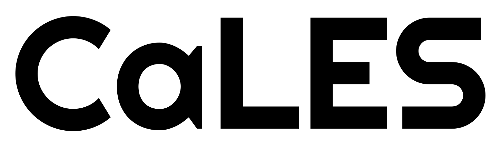

<!--- the logo -->

CaLES (Canonical Large-Eddy Simulation) is a GPU-accelerated finite-difference solver for large-eddy simulations (LES) of incompressible wall-bounded flows in massively parallel environments. Built upon the DNS solver CaNS, it employs low-storage third-order Runge-Kutta schemes for time integration and supports implicit Crank-Nicolson treatment of viscous terms. A fast direct solver based on eigenfunction expansions is used for Poisson/Helmholtz equations. CaLES implements the Smagorinsky model (with van Driest damping), the dynamic Smagorinsky model, and a logarithmic law wall model. It supports various flow configurations, including channel flows, square ducts, tri-periodic domains, and lid-driven cavities. More details can be found in the official documentation: [CaLES Documentation](https://cales.readthedocs.io/en/latest/).
